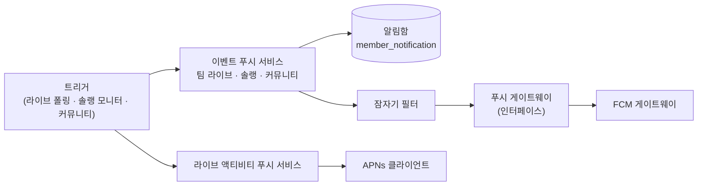

# 알림 발송 아키텍처

2026-09-06 기준. 노드 8개 이내로 역할 단위만 그린다(클래스 전수 아님).

## 읽는 법

- **트리거 3곳**이 시작점. 전부 스케줄러 파드에서 돈다.
  - 경기 이벤트: `app/lolesports/live/LivePollingScheduler`
  - 솔랭 종료: `app/riot/PlayerSoloRankMonitorService`, `SoloRankEndNotificationService`
  - 커뮤니티 댓글·좋아요: `app/community/service/Community*Notifier`
- **일반 알림 경로**: 이벤트 서비스(`TeamLiveEventPushService`, `PlayerSoloRankPushService`, `Community*Notifier`)가
  알림함(`MemberNotificationService`)에 적고, 잠자기 필터(`QuietAwarePushSender`)가 야간 회원을 걸러낸 뒤
  게이트웨이 인터페이스(`MobilePushGateway`)로 넘긴다. 구현체는 `FirebaseMobilePushGateway` 하나.
- **라이브 액티비티 경로**(`LiveActivityPushService`)는 별도다. 알림함에 적지 않고 잠자기 필터도 타지 않는다.
  `ApnsLiveActivityClient` 로 APNs 직결.

## 그림에서 생략한 것

- 발송 멱등 테이블: `member_team_event_push_delivery`, `player_solo_rank_push_delivery`, `live_activity_card_dispatch`
- 토큰 리포지토리(FCM 토큰, `live_activity_token`, `live_activity_start_token`)
- 디스코드 웹훅(내부 채널, 유저 알림 아님)
