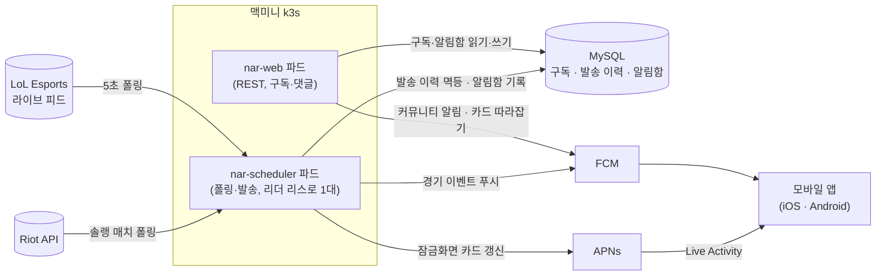
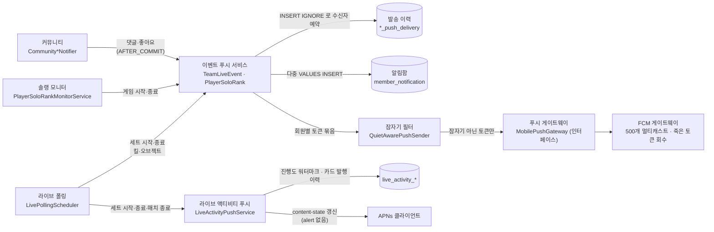

# 알림 발송 아키텍처

2026-09-06 기준. C4 모델로 두 레벨만 그린다 — Container(배포 단위)와 Component(알림 패키지 내부).
한 그림에 두 레벨을 섞지 않는다. 클래스 전수가 아니라 역할 단위다.

## 1. Container — 알림이 어디서 어디로 가는가

읽는 법
- 발송 주체는 둘. **스케줄러 파드**가 경기·솔랭 이벤트를 발송하고, **웹 파드**는 사용자 액션(댓글·구독)에 따라 즉시 발송한다.
- 스케줄러는 `RollingUpdate` 로 두 파드가 겹칠 수 있지만, DB 리더 리스(`scheduler_lease`)를 잡은 하나만 잡 본문을 실행한다.
- 두 파드는 JVM 이 다르다. 인메모리 상태(Caffeine, `LiveStateStore`)는 공유되지 않으므로 발송 관련 상태는 전부 DB 에 둔다.
- iOS 잠금화면 카드는 FCM 으로 못 보낸다. ActivityKit 푸시 토큰은 FCM 등록 토큰이 아니라 APNs 직결이다.

## 2. Component — `app/mobile/push` 내부

%% POLL   → app/lolesports/live/LivePollingScheduler, LiveObjectEventRecorder
%% SOLO   → app/riot/PlayerSoloRankMonitorService, SoloRankEndNotificationService
%% COMM   → app/community/service/CommunityCommentNotifier, CommunityLikeNotifier
%% EVT    → app/mobile/push/TeamLiveEventPushService, PlayerSoloRankPushService
%% QUIET  → app/mobile/push/QuietAwarePushSender, app/mobile/member/QuietHoursResolver
%% GW     → app/mobile/push/MobilePushGateway, FirebaseMobilePushGateway
%% LA     → app/mobile/push/LiveActivityPushService, LiveActivityCatchUpService, LiveActivityOrphanCardSweeper
%% FEED   → app/mobile/notification/MemberNotificationService, MemberNotificationRetentionService

읽는 법
- **일반 알림 경로**(위쪽): 이벤트 → 발송 이력에 수신자 예약(멱등) → 알림함 기록 → 잠자기 필터 → FCM.
- **라이브 액티비티 경로**(아래쪽)는 알림함도, 잠자기 필터도 타지 않는다. 소리·배너가 없는 content-state 갱신이라 끼울 지점이 없다.
- 그림에서 생략: DTO, 토큰 리포지토리(`member_device`, `live_activity_token`), 디스코드 웹훅(내부 채널), 스토어 리뷰 알림.

## 3. 기술적으로 고려한 것

면접·스터디용. "왜 이렇게 했나"를 한 줄씩. 실측 수치는 코드 주석에 남긴 값이다.

| 문제 | 선택 | 대안과 버린 이유 |
|---|---|---|
| **중복 발송** — 폴링 재발화, 파드 재기동, 양 팀 동시 구독 | 발송 이력 테이블에 `(member, matchId, setNumber, eventType, eventOrder)` 유니크 키로 `INSERT IGNORE`. 성공한 행만 발송 대상 | 인메모리 Set 은 파드가 둘이 되며(#442) 깨졌다. 멱등 키를 팀이 아니라 matchId 로 잡아 양 팀 구독자도 이벤트당 1회 |
| **정확히 하나의 발송자** | 스케줄러 파드 리더 리스(5초 갱신, TTL 15초). 리더만 `@Scheduled` 본문 실행 | `Recreate` 전략은 교체 공백이 수십 초. 리스 덕에 `RollingUpdate` 로 공백 4초(실측 2026-08-23) |
| **파드 분리 후 인메모리 상태** | 카드 발행 창(Caffeine) → DB 시계, 라이브 여부 판정 → DB 프레임 신선도 보강 | 웹 파드의 `LiveStateStore` 가 영구히 비어 따라잡기가 항상 no-op 이었다(실측 2026-08-23) |
| **세트 종료 재발화로 카드 역행** | 매치별 진행도 워터마크. 뒤처진 이벤트는 카드에 반영하지 않음 | FCM 은 발송 이력이 막지만 카드엔 장치가 없어 1세트 종료가 2세트 중 5회 재발화(실측 2026-07-31) |
| **야간 알림** | 잠자기 필터를 게이트웨이 앞 한 곳에. KST 고정, 자정 넘는 구간 지원 | 조회 실패 시 **전원 발송(fail-open)**. 알림이 조용히 사라지는 것보다 나가는 게 낫다 |
| **죽은 FCM 토큰** | 응답의 `UNREGISTERED`·`INVALID_ARGUMENT` 토큰을 결과에 실어 호출부가 삭제 | 500개 멀티캐스트 한도에 맞춰 청크. 토큰별 결과가 있어야 "누가 받았는지" 알림함에 정확히 남긴다 |
| **팬아웃 지연** | 알림함 기록을 다중 VALUES INSERT 로 직접 | `saveAll` 은 IDENTITY 키라 배치 불가 → 구독자 수만큼 왕복. 1,440명 20초 실측(EC2 시절, DB 원격) |
| **알림함 무한 증가** | 타입별 보존 기간. LIVE_EVENT 짧게, SET_START/END 길게 | LIVE_EVENT 하루 2.7만 건에 열람률 0.13%, SET 이벤트는 하루 5.8천 건이고 회고 가치 있음 |
| **iOS 잠금화면 카드 갱신** | 서버가 APNs 로 직접 갱신. push-to-start 는 별도 스위치 | 앱 30초 폴링은 포그라운드에서만 동작. 잠금화면을 보는 상황이 곧 백그라운드라 "앱 켜 놓을 때만 맞는 위젯"이었다 |
| **카드 고착** | 종료 이벤트에 편승 + 끝난 경기의 살아있는 카드를 DB 상태로 주기 스윕 | 이벤트 기반만으론 스코어 지연·bestOf 미상·재기동 틈에 카드가 iOS 한도 8시간까지 남는다. bestOf 미상은 스윕도 보류(오염된 completed 를 증폭하지 않기 위해) |
| **틀린 스코어 알림** | SET_END 는 세트 N 종료 시 스코어 합이 N 이어야 함. 아니면 10초 × 6회 업스트림 재조회, 그래도 stale 이면 스코어 생략 | 네이버 반영이 세트 종료 후 ~1분(실측). 틀린 숫자보다 없는 숫자 |
| **피드 이상값** | 프레임 간 킬 +5, 타워 +2, 바론·드래곤 +1 초과 점프는 폐기 | 피드가 뒤늦게 몰아서 오면 킬 알림이 한 번에 쏟아진다 |
| **댓글 트랜잭션과 푸시** | `AFTER_COMMIT` 리스너에서 발송. 실패는 삼킨다 | 트랜잭션이 락을 쥔 채 FCM 을 기다리지 않고, 롤백된 댓글로 알림이 나가지 않는다 |
| **미완성 기능 배포** | `live.notification.fcm.enabled`, `APNS_ENABLED`, `APNS_PUSH_TO_START_ENABLED` 플래그 | 트렁크 기반 개발이라 OFF 로 머지. 플래그가 꺼지면 조회조차 하지 않는다 |

## 4. 한 문장 요약

"폴링으로 잡은 경기 이벤트를 DB 멱등 키로 한 번만 예약하고, 잠자기 필터를 거쳐 FCM 으로 내보낸다.
iOS 잠금화면 카드는 별도로 APNs 직결이며, 파드가 둘이라 발송 상태는 전부 DB 에 둔다."
